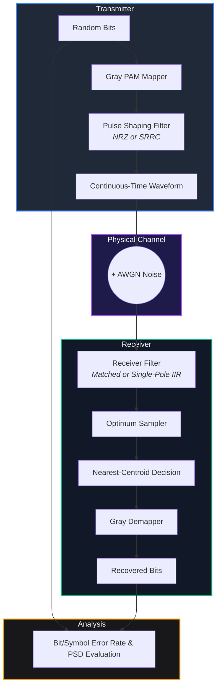
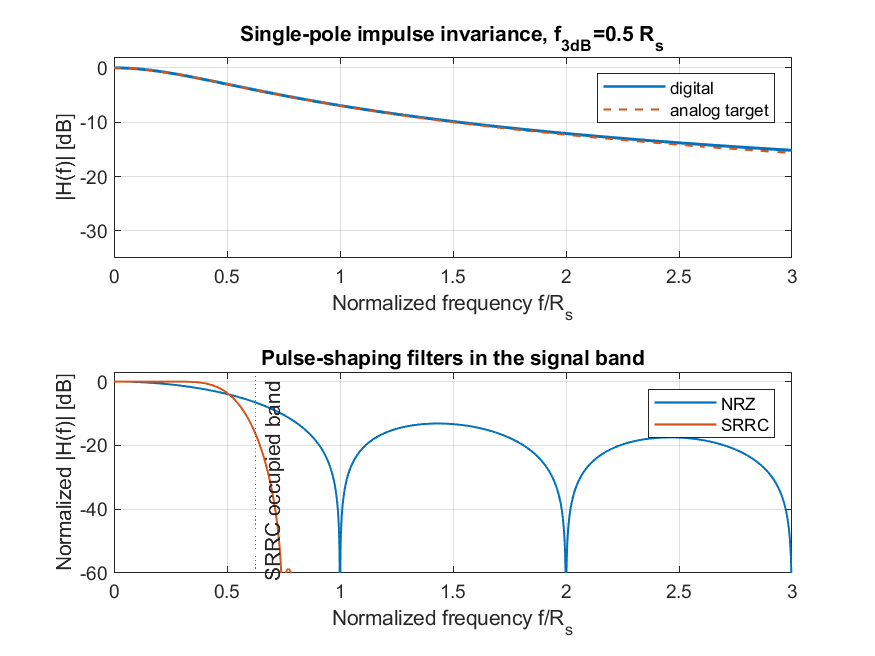
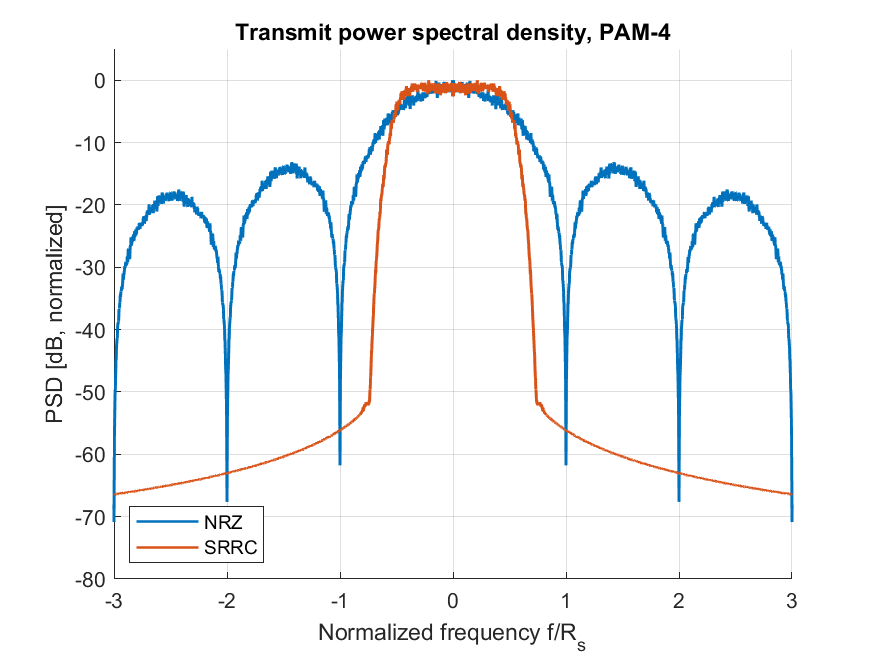
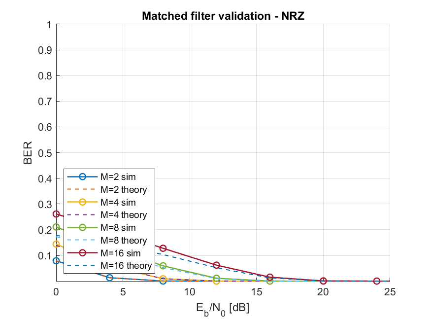
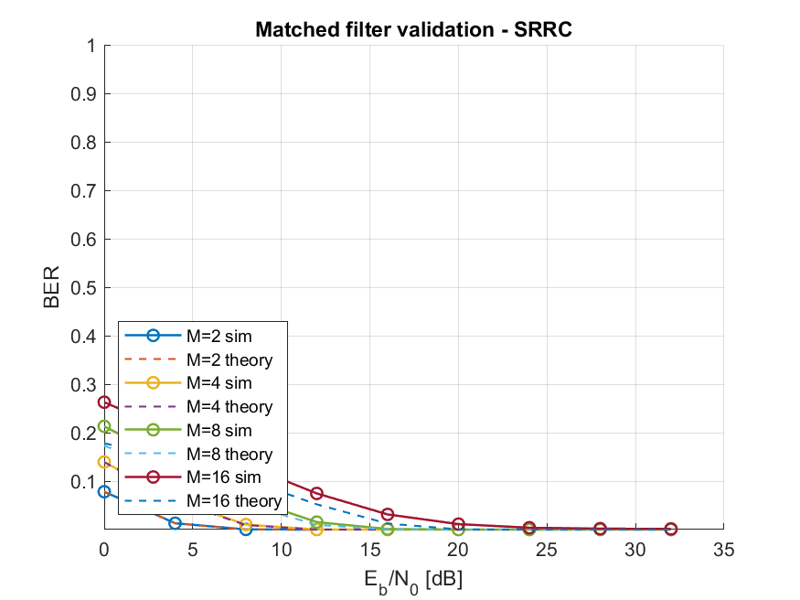
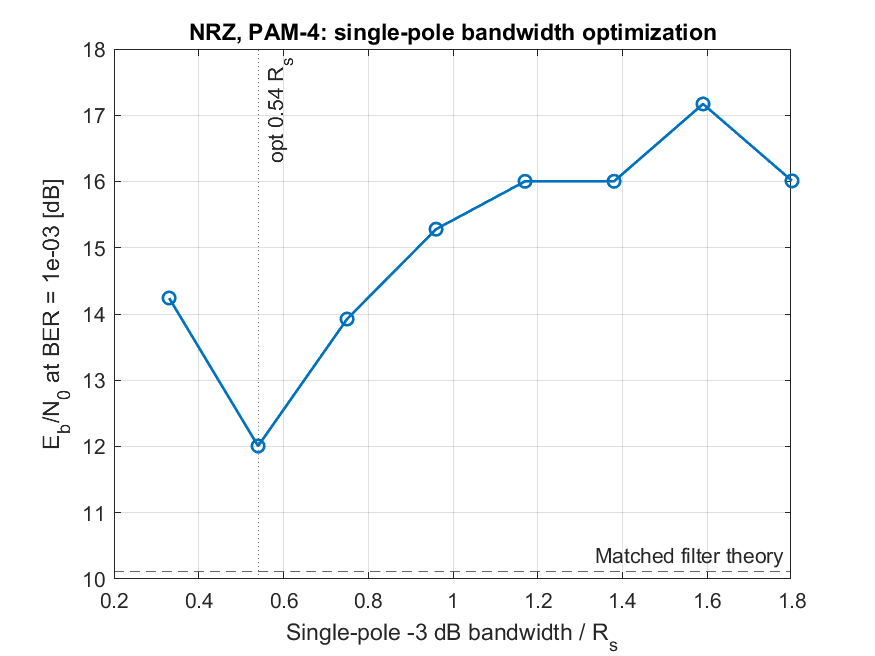
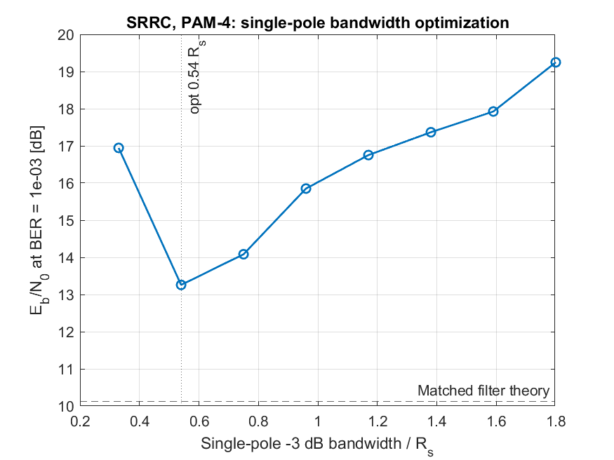
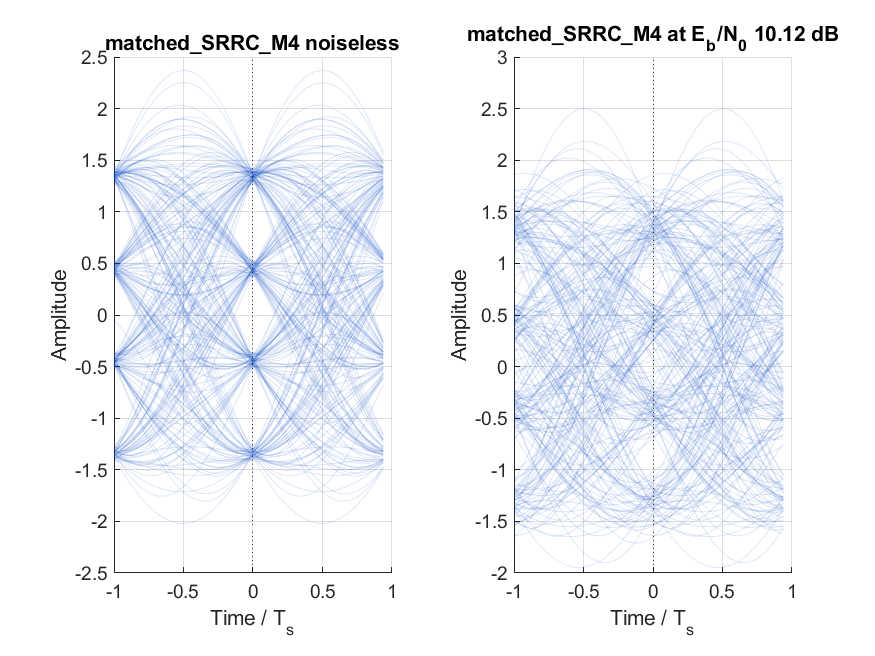
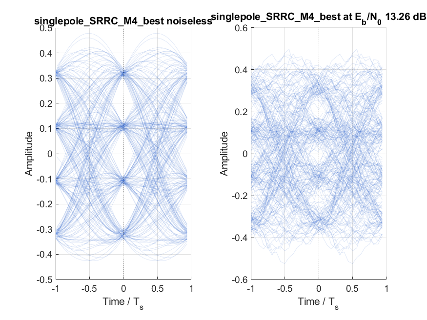

# 📡 Digital Transmission System Simulator
[](https://www.mathworks.com/products/matlab.html)
[](https://www.polito.it)
[](#)

A modular, high-fidelity MATLAB simulation suite for analyzing digital baseband transmission using **PAM-M modulation** over Additive White Gaussian Noise (AWGN) channels.

This project was built to address the requirements of **TLC Virtual Lab #2**, modeling the complete communication chain and comparing numerical performance against theoretical limits for matched-filter and band-limited receivers.

---

## 🏗️ System Architecture

The simulation models a complete discrete-time baseband communications link. The modular signal path is structured as follows:



> [!NOTE]  
> The simulator is engineered entirely from scratch. It avoids using the MATLAB Communications Toolbox for modulation, demapping, or filtering, exposing the direct mathematical operations of digital signal processing.

---

## 📈 Technical Highlights & Evidence

### 1. Filter Synthesis & Spectral Calibration
To ensure correct power and energy scaling, transmit pulses are strictly normalized. The simulator supports:
* **NRZ Pulses**: Rectangular pulse duration equal to one symbol interval.
* **SRRC Pulses**: Synthesized using a frequency-domain sampling technique with a local Hamming window helper.
* **Single-Pole IIR Filter**: Synthesized via the impulse invariance method to evaluate bandwidth constraints and Inter-Symbol Interference (ISI).

<p align="center">
  
  
  <br>
  <i>Figure 1: Spectral-domain filter synthesis verification (left) and transmit Power Spectral Density comparison (right).</i>
</p>

---

### 2. Matched Filter BER Validation
To prove numerical correctness, the simulation runs Monte Carlo sweeps for modulation orders $M \in \{2, 4, 8, 16\}$ using a matched filter. These are validated against the exact theoretical Gray-coded PAM-M bit error probability:

$$P_b \approx \frac{2(M-1)}{M \log_2(M)} Q\left(\sqrt{\frac{6 \log_2(M)}{M^2 - 1} \frac{E_b}{N_0}}\right)$$

<p align="center">
  
  
  <br>
  <i>Figure 2: Simulated vs. Theoretical Bit Error Rate (BER) curves using a Matched Filter for NRZ (left) and SRRC (right).</i>
</p>

---

### 3. Receiver Bandwidth Optimization
When the receiver is constrained to a simple digital single-pole low-pass filter, a fundamental trade-off arises:
* **Too narrow**: Limits noise power but causes heavy Inter-Symbol Interference (ISI).
* **Too wide**: Eliminates ISI but lets in excessive AWGN noise.

The simulator sweeps the normalized bandwidth ($B_{3\text{dB}} \cdot T_s$) to locate the exact "valley" that minimizes the required $E_b/N_0$ to achieve a target $\text{BER} = 10^{-3}$.

<p align="center">
  
  
  <br>
  <i>Figure 3: Required Eb/N0 at target BER vs. Single-Pole receiver bandwidth for NRZ (left) and SRRC (right) for PAM-4.</i>
</p>

The optimization results are compiled directly below:

| Modulation Order ($M$) | Pulse Shape | Optimum Bandwidth ($B_{3\text{dB}} \cdot T_s$) | Min Required $E_b/N_0$ at $10^{-3}$ (dB) | Matched Filter $E_b/N_0$ (dB) | SNR Penalty (dB) |
| :---: | :---: | :---: | :---: | :---: | :---: |
| **PAM-2** | NRZ | $0.33$ | $8.01$ | $6.42$ | **$+1.59$** |
| **PAM-4** | NRZ | $0.54$ | $12.01$ | $10.12$ | **$+1.89$** |
| **PAM-8** | NRZ | $0.54$ | $18.15$ | $14.39$ | **$+3.75$** |
| **PAM-16** | NRZ | $0.75$ | $23.68$ | $19.15$ | **$+4.54$** |
| **PAM-2** | SRRC | $0.54$ | $8.01$ | $6.42$ | **$+1.59$** |
| **PAM-4** | SRRC | $0.54$ | $13.26$ | $10.12$ | **$+3.14$** |
| **PAM-8** | SRRC | $0.54$ | $18.60$ | $14.39$ | **$+4.21$** |
| **PAM-16** | SRRC | *Sweep Incomplete* | *Penalty Limit Exceeded* | $19.15$ | *N/A* |

---

### 4. Eye Diagram Analysis
Eye diagrams provide a powerful visual representation of signal quality, noise susceptibility, and ISI:

* **Matched Filter**: Exhibits wide, clean open eyes (zero ISI for SRRC at sampling instances due to Nyquist criterion satisfaction).
* **Single-Pole Filter**: Shows eye closing (ISI traces) even in the noiseless case, and extreme clutter in noisy conditions.

<p align="center">
  
  
  <br>
  <i>Figure 4: PAM-4 SRRC Eye Diagrams. Matched Filter (left) showing perfect Nyquist sampling, vs. Optimized Single-Pole Filter (right) showing significant ISI distortion.</i>
</p>

---

## 📂 Repository Structure

The simulator is organized as a clean engineering project rather than a single spaghetti script. This modularity makes it easy to isolate and verify specific steps of the communication chain.

```text
.
├── TLC_Lab2_Project.m                    # Master execution script
├── config/
│   └── lab2Config.m                      # Simulation parameter config
├── filters/
│   ├── buildTxPulses.m                   # Generates normalized NRZ/SRRC pulses
│   ├── singlePoleImpulseInvariance.m    # Digital single-pole filter generator
│   └── srrcFrequencySampling.m           # Synthesizes SRRC pulses via frequency sampling
├── modulation/
│   ├── pamGrayMap.m                      # Gray-coded PAM symbol mapper
│   ├── pamGrayDemap.m                    # Gray-coded PAM symbol demapper
│   ├── grayToBinary.m                    # Gray-to-binary index converter
│   └── decideNearest.m                   # Nearest-centroid symbol decision rule
├── simulation/
│   ├── simulatePamAwgn.m                 # Runs end-to-end transceiver transmission
│   ├── takeAlignedSamples.m              # Aligns received samples with transmitted bits
│   ├── findBestPamSampling.m             # Locates optimum sampling phase
│   ├── runMatchedFilterValidation.m      # Loops through matched-filter experiments
│   └── runSinglePoleOptimization.m       # Bandwidth sweeping optimizer
├── plotting/
│   ├── drawEye.m                         # Low-level eye diagram drawer
│   ├── plotEyeExamples.m                 # High-level eye diagram plotter
│   ├── plotFilterSynthesisEvidence.m     # Plots filter responses & frequency sampling details
│   └── plotPulsePsd.m                    # Plots transmit power spectrums
├── utils/
│   ├── theoreticalPamBer.m               # Math calculations for theoretical PAM BER
│   ├── interpEbN0AtBer.m                 # Linear interpolator to locate target BER Eb/N0
│   ├── qfunLocal.m                       # Standard mathematical Q-function
│   ├── hammingLocal.m                    # Hamming window function
│   └── simplePsd.m                       # Welch-based power spectral density estimator
└── documentation/
    ├── final_project_report.pdf          # Full engineering report (Politecnico di Torino format)
    ├── optimization_summary.csv          # Numeric CSV results of best single-pole sweeps
    ├── srrc_m16_explore.csv              # Sweep details of PAM-16 SRRC explorer
    └── figures/                          # Saved report PNG plots
```

---

## 🚀 Running the Simulator

### Prerequisites
* MATLAB R2023b or later (no external toolboxes needed).

### Main Entry Point
The main file to run is:

```text
TLC_Lab2_Project.m
```

### Standard Execution
Open MATLAB in the project directory and execute:

```matlab
run('TLC_Lab2_Project.m')
```
This runs the full high-accuracy simulation suite (high bit count, fine Eb/N0 steps), regenerating all result figures in `results_lab2/` and console printouts.

### Quick Smoke Test (Fast Mode)
To run a fast sanity check on the pipeline without waiting for long Monte Carlo sweeps, set the environment flag `TLC_LAB2_FAST` to `1` in PowerShell before launching:

```powershell
$env:TLC_LAB2_FAST='1'
matlab -batch "run('TLC_Lab2_Project.m')"
```
This automatically scales down the bit counts, Eb/N0 sweeps, and PAM orders for a 5-second verification run.

---

## 🎨 Design Philosophy
* **Extreme Transparency**: Key formulas (e.g., Gray code mapping, Q-function, PSD estimation, and filter design) are written explicitly in code to prioritize educational value over tool abstraction.
* **Component Modularity**: Easily swap out modular components. For example, you can plug in a new modulation technique (QAM, PSK) or a different channel model (Rayleigh fading, multipath) without touching the transmitter or receiver filter logic.
* **Comprehensive Diagnostic Graphics**: Plots are auto-formatted with balanced margins, legible labels, legends, and clear grids, perfectly suited for inclusion in formal engineering reports.

---

## 🎓 Skills Reflected
* **Communication Systems Engineering**: Bit mapping, AWGN channel physics, noise calibration ($E_b/N_0$ conversion), matched filter theory, Nyquist pulse shaping criterion.
* **Digital Signal Processing**: IIR/FIR filter synthesis, impulse invariance, frequency sampling, windowing, Power Spectral Density estimation, sampling phase alignment.
* **Reproducible Research**: Decoupled parameters, environment-driven debug modes, clear logging, automated CSV summary exporting, structured layouts.
