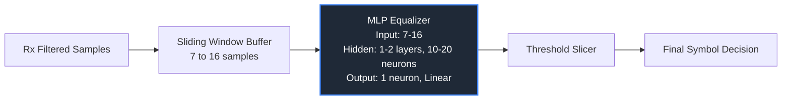
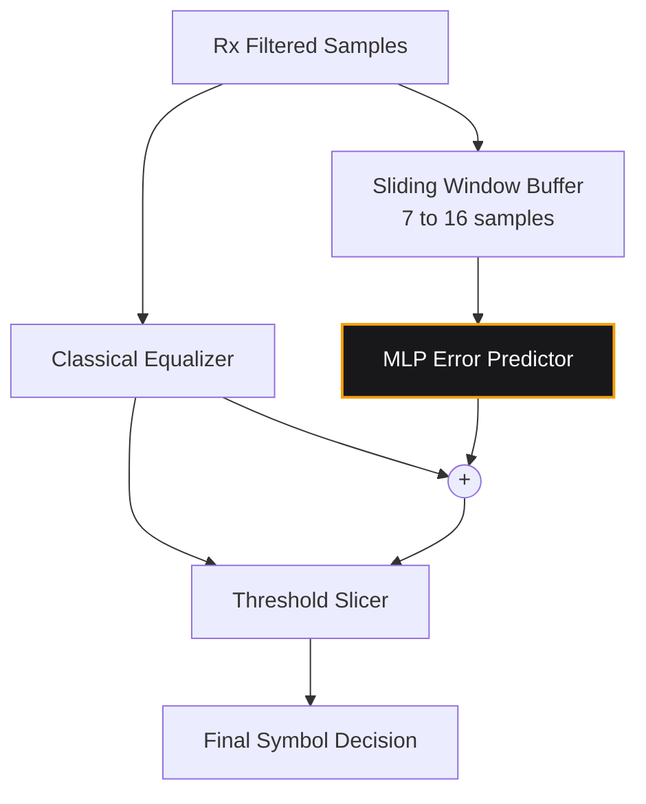

# Thesis Proposal Refinement: NN-Assisted PAM Receiver

This document provides a rigorous academic refinement of the initial neural-network-assisted PAM receiver proposal, integrating the constraints and guidance provided by your thesis advisor:
* **Model Type:** Multi-Layer Perceptron (MLP) for filtering/equalization.
* **Input Dimension:** $7$ to $16$ samples (sliding window).
* **Network Depth:** $1$ or $2$ hidden layers.
* **Network Width:** $10$ to $20$ neurons per hidden layer.

---

## 🔍 Critique of the Codex Two-Stage Proposal

The initial proposal suggested a **two-stage** framework: a **Verifier** (binary classification to check reliability) followed by a **Corrector** (multi-class classification to correct suspicious decisions).

While conceptually interesting, this architecture has several major drawbacks for a master's thesis in telecommunications engineering:

1. **Error Propagation (Cascading Failures):** If the Verifier commits a *false negative* (decides a wrong symbol is correct with high confidence), the Corrector is never triggered, and the error is locked in.
2. **Computational Latency & Branching:** In high-speed DSP hardware (like FPGAs or ASICs), conditional branching (`if confidence < threshold then run Corrector`) introduces variable processing latency. High-speed communication links require deterministic, pipelined data flows. A single-stage, fixed-latency architecture is highly preferred.
3. **Hyperparameter Tuning Complexity:** The system introduces an artificial "confidence threshold" parameter. Optimizing this threshold across different SNR ($E_b/N_0$) values adds significant experimental overhead without theoretical justification.
4. **Double Training Overhead:** Training two separate neural networks (one binary, one multi-class) increases the training complexity and data storage requirements.

---

## 🛠️ Refined Architectures (Advisor-Compliant)

To align with your professor's instructions, we propose replacing the two-stage model with a **single-stage MLP** that acts directly as a **Non-Linear Equalizer (NLE)** or a **Joint Filter-Classifier**. 

Below are the three best alternatives, ranked by their suitability for a thesis.

### Option A: MLP-Based Non-Linear Equalizer (Recommended)
In this configuration, the MLP acts as a direct replacement for the classical equalizer (e.g., Feed-Forward Equalizer, FFE). It takes a window of received samples and outputs a single real number representing the equalized symbol, which is then sliced by a classical threshold detector.

* **Inputs:** $7$ to $16$ consecutive received samples $[r(k-L), \dots, r(k), \dots, r(k+R)]$.
* **Hidden Layers:** $1$ or $2$ layers, $10$ to $20$ neurons each (with ReLU or Tanh activations).
* **Output Layer:** $1$ neuron with linear activation, representing the estimate $\hat{y}(k)$ of the transmitted symbol amplitude.
* **Why it is strong for a thesis:**
  * **Direct Comparison:** You can compare the MLP directly against a classical linear equalizer (like a Least Mean Squares (LMS) or Recursive Least Squares (RLS) equalizer) of the same tap length ($7$ to $16$).
  * **Non-linear Compensation:** You can easily simulate a channel with non-linearities (e.g., power amplifier saturation or fiber-optic Kerr effect) and show that the MLP vastly outperforms classical linear equalizers because it can learn non-linear decision boundaries.

---

### Option B: MLP Joint Equalizer & Classifier
This configuration completely bypasses the classical threshold slicer. The MLP directly classifies which of the $M$ PAM symbols was transmitted.

* **Inputs:** $7$ to $16$ received samples.
* **Hidden Layers:** $1$ or $2$ layers, $10$ to $20$ neurons each.
* **Output Layer:** $M$ neurons with Softmax activation (where $M = 2, 4, 8, \text{ or } 16$ is the PAM order). The output represents the probability distribution over the PAM constellation points.
* **Why it is strong for a thesis:**
  * **Maximum Likelihood Approximation:** Under severe inter-symbol interference (ISI), the optimal receiver (sequence estimation) is highly complex. The MLP classifier acts as a low-complexity approximation of the optimal boundary.
  * **Soft Outputs:** The softmax probabilities can be forwarded directly to a Soft-Input Soft-Output (SISO) channel decoder (like a Viterbi or LDPC decoder) in a full receiver chain.

---

### Option C: Residual NN-Assisted Decision (Hybrid)
This option keeps the classical receiver fully intact. The MLP is placed in parallel and only predicts the *residual error* or the *correction term* to adjust the equalized sample before slicing.

* **Inputs:** $7$ to $16$ received samples (or equalized samples).
* **Hidden Layers:** $1$ or $2$ layers, $10$ to $20$ neurons each.
* **Output Layer:** $1$ neuron predicting the residual distortion $\Delta(k)$ to subtract from the classical output.
* **Why it is strong for a thesis:**
  * **Graceful Degradation:** If the neural network encounters an SNR region it wasn't trained on, the system degrades gracefully back to the classical equalizer performance rather than failing catastrophically.

---

## 📊 Comparison Matrix

| Metric / Dimension | Codex Two-Stage Proposal | Option A: MLP Equalizer (NLE) | Option B: MLP Classifier | Option C: Residual MLP |
| :--- | :--- | :--- | :--- | :--- |
| **Advisor Alignment** | Low (uses multiple MLPs outside filtering) | **High** (MLP acts directly as the filter/equalizer) | **High** (MLP replaces filter + decision) | **Medium** (Hybrid helper) |
| **Hardware Feasibility** | Poor (variable latency, branching) | **Excellent** (deterministic, pipelined) | **Excellent** (deterministic, pipelined) | **Good** (requires parallel processing) |
| **Training Complexity** | High (must train 2 models, label boundary cases) | **Low** (standard MSE regression) | **Medium** (Cross-entropy over $M$ classes) | **Low** (MSE regression on error residuals) |
| **System Complexity** | High (complex control flow) | **Very Low** (standard filter replacement) | **Very Low** (direct classification) | **Medium** (parallel classical/NN paths) |
| **Key Research Value** | Complex heuristics | Show performance under channel non-linearities | Approximating optimal decision boundaries | Graceful degradation under model mismatch |

---

## 📝 Recommended Thesis Methodology & Scenario

For a thesis to be accepted by telecommunication professors, the use of Machine Learning must be justified by showing it solves a problem where classical methods struggle. Linear equalizers (like LMS) are already optimal for linear channels with AWGN. Therefore, your thesis should evaluate the MLP in a **non-linear channel scenario**.

### Proposed Evaluation Setup
1. **Channel Model:** 
   * Add a **Non-Linear Amplifier (High Power Amplifier - HPA)** block in the transmitter using a standard model (e.g., Rapp or Saleh model) that introduces AM-to-AM and AM-to-PM amplitude distortion.
   * Add a multipath channel causing linear ISI.
2. **Receiver Baselines to Compare:**
   * **Baseline 1:** Matched Filter + Zero Equalization (AWGN limit).
   * **Baseline 2:** Matched Filter + Linear FFE (LMS) equalizer (shows that linear equalizers fail to resolve non-linear distortion).
   * **Baseline 3 (Your Work):** Matched Filter + MLP-Based Non-Linear Equalizer (Option A).
   * **Baseline 4 (Your Work):** Matched Filter + MLP Joint Classifier (Option B).
3. **Key Performance Metrics:**
   * **BER vs. $E_b/N_0$:** Plot curves for PAM-2, 4, 8 to find the $E_b/N_0$ gain of the MLP.
   * **Decision Boundaries:** Plot 2D scatter plots of the received samples showing the linear boundaries of the LMS equalizer vs. the non-linear boundaries learned by the MLP.
   * **Complexity Analysis:** Compare the number of multiplications and additions required per symbol for the LMS equalizer vs. the MLP.
